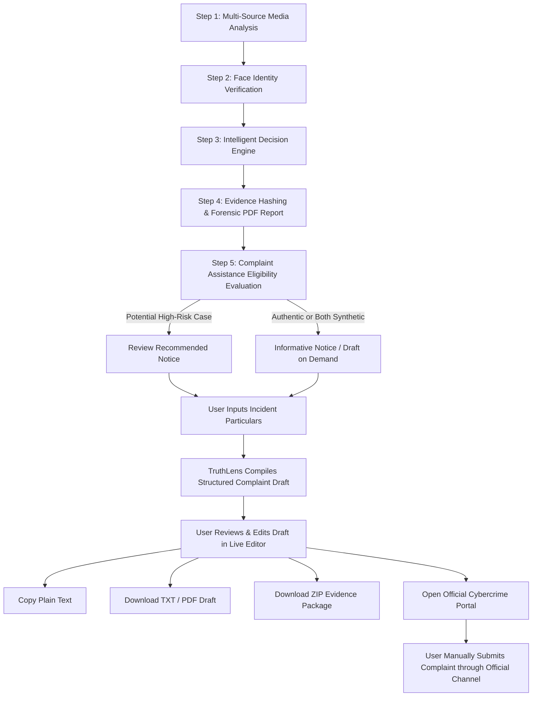

# TruthLens — Cybercrime Complaint Assistance & Incident Packaging

**Document Version:** 1.0  
**Status:** Task 5 Completed  
**Classification:** Digital Forensics & Incident Response Assistance  

---

## 1. Purpose

The **TruthLens Cybercrime Complaint Assistance** module bridges the gap between automated digital media forensic screening and formal cyber incident reporting. 

When manipulated media (such as face-swapped deepfakes, synthetic audio/video impersonations, or unauthorized AI media) is detected, victims and forensic examiners often face confusion regarding how to package forensic findings into actionable complaint narratives for official reporting channels.

> **CRITICAL LEGAL NOTICE:**  
> **TruthLens assists with preparation of a complaint draft but does not automatically file or submit complaints.**  
> TruthLens is an AI-assisted forensic screening and evidence-preparation platform. It does **not** determine criminal guilt, does **not** claim that a crime has been legally established, and does **not** automatically submit user information to any law enforcement or government agency. The user retains complete authority and manual control over the final filing.

---

## 2. End-to-End Workflow

---

## 3. Complaint Eligibility & Risk Mapping

TruthLens avoids blanket or automated escalation. Not all synthetic or modified media constitutes cybercrime:

| Assessment Category | Risk Level | Assistance Status | Guidance Displayed |
| :--- | :--- | :--- | :--- |
| **POTENTIAL_DEEPFAKE** | **HIGH** | `REVIEW_RECOMMENDED` | **"Potential high-risk case identified."** TruthLens prepares a complaint draft using verified forensic signals and your statement. |
| **BOTH_MEDIA_APPEAR_SYNTHETIC** | **MEDIUM** | `NOT_REQUIRED` | **"Review circumstances before deciding whether to report."** Both media files exhibit synthetic generation indicators. |
| **LIKELY_AUTHENTIC** | **LOW** | `NOT_REQUIRED` | **"Suspected media appears authentic."** Automated complaint recommendation is not suggested. |
| **INCONCLUSIVE / OTHER** | **UNKNOWN** | `NOT_REQUIRED` | **"Review case findings."** Draft preparation remains available upon explicit user request. |

---

## 4. User Input & Anti-Fabrication Principles

TruthLens enforces strict anti-hallucination and evidence integrity rules. The system **never** invents unverified facts.

### A. Facts Automatically Populated from Verified Case Record
- Case ID (`TL-YYYY-NNNNNN`)
- UTC Analysis Timestamp
- Reference Media SHA-256 Hash and Size
- Suspected Media SHA-256 Hash and Size
- Independent AI Authenticity Classifications
- Multi-Face Verification Verdict and Cosine Similarity Score
- Decision Engine Category, Risk Level, and Forensic Explanation
- Forensic Report Reference (`TruthLens_Report_{case_id}.pdf`)

### B. Incident Details Provided by the User
- **Incident Date & Time**: When the content was observed or distributed.
- **Platform / Service**: Instagram, Facebook, WhatsApp, YouTube, X/Twitter, Telegram, LinkedIn, or custom.
- **Platform / Post URL**: Direct link to the unauthorized publication.
- **Suspected Account / Username**: Handle or profile identifier of suspected distributor.
- **Incident Description (Statement of Facts)**: User-authored description of the incident.
- **Observed Harm / Impact**: Reputational, financial, or personal consequences.
- **Additional Information**: Associated case references, platform report IDs, or witness details.

> Any omitted or unknown field is explicitly designated as `"Not provided"` or left blank.

---

## 5. Neutral & Objective Language Policy

The complaint draft adheres to strictly neutral, forensic language:
- **Prohibited:** `"The accused created the deepfake"`, `"Crime detected"`, `"Criminal identified"`.
- **Enforced:** `"The media appears potentially manipulated based on automated forensic screening."`, `"The reference and suspected media exhibit high identity similarity with synthetic generation markers."`

---

## 6. Export & Packaging Capabilities

TruthLens provides multi-format export capabilities to suit diverse filing procedures:

1. **Plain Text (`.txt`)**: Clean, formatted text ready for copy-pasting directly into online reporting portals.
2. **User-Reviewable Complaint Draft (`.pdf`)**: Formatted A4 document clearly watermarked and labeled:  
   `"USER-REVIEWABLE COMPLAINT DRAFT — NOT AN OFFICIAL FILING"`.
3. **Forensic Report (`.pdf`)**: Complete multi-page technical report generated in Task 4.
4. **Digital Evidence Package (`.zip`)**: Secure archive named `TruthLens_Evidence_{case_id}.zip` bundling:
   - `TruthLens_Complaint_Draft_{case_id}.txt`
   - `TruthLens_Complaint_Draft_{case_id}.pdf`
   - `TruthLens_Forensic_Report_{case_id}.pdf`
   - `Evidence_Manifest_{case_id}.json` (SHA-256 hashes, metadata, and timestamps)

---

## 7. Official Cybercrime Portal Handoff

TruthLens does not scrape, bypass, or automate government portal submissions. Instead, it provides a direct, verified handoff link to the official reporting authority:
- **Default Official Portal:** [National Cyber Crime Reporting Portal (cybercrime.gov.in)](https://cybercrime.gov.in/)
- **Configurability:** Settable via the `OFFICIAL_CYBERCRIME_PORTAL_URL` environment variable.

---

## 8. Security & Privacy Safeguards

- **No Public Disclosure:** Drafts and case records are restricted to authenticated sessions.
- **Input Sanitization:** All user inputs (descriptions, dates, URLs, handles) undergo strict HTML escaping, length limiting, and regex validation to prevent script injection (XSS) and SQL injection.
- **Path Traversal Protection:** All case identifiers are strictly validated against `^TL-\d{4}-\d{6}$`.
- **Safe Packaging:** ZIP archives never contain internal server secrets, environment variables, server filepaths, or raw face embeddings.
- **Zero Third-Party Leaks:** No incident data is transmitted to third-party services or external AI APIs.

---

## 9. API Reference

| Method | Endpoint | Description |
| :--- | :--- | :--- |
| `GET` | `/cases/{case_id}/complaint-eligibility` | Evaluates case eligibility and returns recommendation status. |
| `POST` | `/cases/{case_id}/complaint-draft` | Compiles structured draft from case record + user inputs. |
| `POST` | `/cases/{case_id}/complaint-draft/download?format={pdf\|txt}` | Streams compiled draft as PDF or TXT download. |
| `POST` | `/cases/{case_id}/evidence-package/download` | Streams full evidence ZIP package. |

---

## 10. Legal & Forensic Disclaimer

> *TruthLens provides AI-assisted analysis and complaint drafting support. The generated draft is not an official complaint and does not establish that a crime has occurred. Review all information carefully and submit only accurate information through the appropriate official channel. TruthLens does not automatically submit complaints.*
